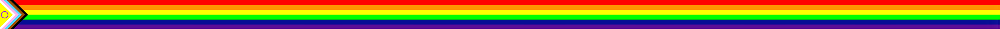
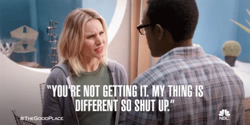
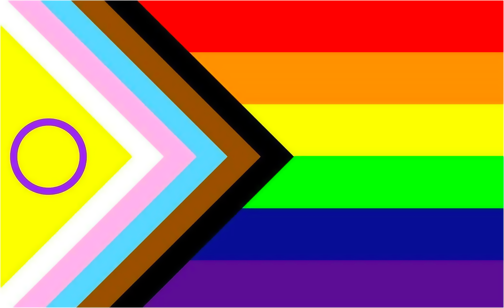

# TERF Nonsense Generator

The world is getting worse and transphobes have no imaginiation so I figured a computer could probably do just as well thinking up talking points

## FAQ

### **What is a TERF?**

TERF stands for "Trans-Exclusionary Radical 'Feminist,'" and originally referred to a segment of the Radical Feminist separatist movement who was opposed to the existence of trans women within lesbian spaces. More recently, the term has come to mean more generally any transphobe, and the people originally described by the term have rebranded themselves as "Gender Critical." It is worth noting that TERFs/Gender Criticals only play at being feminists, and almost exclusively take the side of the far Right in political spaces, to the point of [literally quoting Mein Kampf](https://www.thepinknews.com/2023/01/16/newcastle-let-women-speak-rally-adolt-hitler-trans-speech/) at their rallies.

### **Isn't this just a hatespeech generator?**

look ok when you say it like that it sounds like a much less funny idea ok. That's why I'm adding Infowars and stuff into the training data, and trying to find stuff from conspiracy theory pages -- to ensure it gets absolutely batshit rather than just parroting ideology. But at the end of the day it will be down to the user to prevent misuse. Is that a bad solution? Yes definitely.

### **What training data have you fed the bigotry robot?**

Lots! 

* Several classic TERF books, including
    * *The Transsexual Empire* by Janice Raymond
    * *Gender Hurts* by Sheila Jeffreys
    * *Irreversible Damage* by Abigail Shrier
* Transcripts of Alex Jones' show (Infowars) where he mentions trans people
* web scrapes of r/stevencrowder, r/benshapiro, and r/JordanPeterson
* web scrapes of MumsNet, a British TERF website
* Some straight-up conspiracy theory stuff for spice

### **Why all the rainbow line breaks?**

cuz i'm gay

and like to reenforce that i'm not making this because I agree with terfs in any way

### **Wait ok but what's that thing at the beginning of the rainbow?**

I'm using the Progress Flag! This version of the pride flag was created in 2021 by Valentino Vecchietti of Intersex Equality Rights UK and includes the black and brown chevrons representing PoC, the blue, pink, and white chevrons representing the transgender community, and the purple circle on yellow representing the intersex community.

